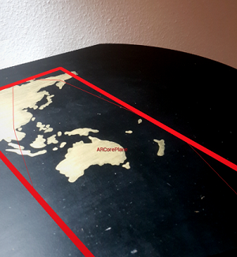

# CompetencyViz

CompetencyViz is an interactive visualization of competencies and their relations.
It is developed as an Anrdroid Application using Augmented Reality, but can also be 
used as a web application.

 

## Features ##
* Using Augmented Reality
* Multi-Platform: Android and Web
* CRUD functionality for competencies and their relations

## Setup ##

### Database ###

1.  Install PostgreSQL
2.	Create User and Database, e.g.:
>  User: „competencyviz“ 
>  Database: „competency“ 
>  Password: „competencyviz“  
>  If different data is chosen, it must be changed in [tagQueries.js](server/node-api-postgres/tagQueries.js) and [tagParentsQueris.js](server/node-api-postgres/tagParentsQueries.js). 

3.	Change Encoding: `set client_encoding to ‘utf8’;`
4.	Create Tables with the file [create.sql](server/sql-data/create.sql): `\i create.sql;`
5.	Add data with the file [data-dev.sql](server/sql-data/data-dev.sql): `\i data-dev.sql;`

### Server ###

1.	Install Node.js
2.	Install Express und node-postgres modules: `npm i express pg`
3.	Start server: `node index.js`

### Client ###

1.  Install Unreal Engine 4
2.  Open the [Unreal Project](client/CompetencyViz/CompetencyViz.uproject)
3.  Change the IP-address in the variable *URL* in the class [BP_VariableStore](client/CompetencyViz/Content/Blueprints/BP_VariableStore.uasset). Standard is localhost.

#### Android ####

1.  In Unreal Engine 4 go to File --> Package Project --> Android --> Android (ETC1) **OR:** Connect you device, click on Launch and choose your device
1.	The APK can now be found in Binaries/Android. Copy it to your device and install the APK.
2.	Eventually ARCore must be installed

#### Web ####

1.  In Unreal Engine 4 go to File --> Package Project --> HTML5 **OR:** Click on Launch and choose a browser
2.  The files can now be found in Binaries/HTML5
3.  With HTML5LaunchHelper.exe a test server can be started
4.  Now you can use the URL [http://localhost:8000//CompetencyViz.html](http://localhost:8000//CompetencyViz.html)

## Usage ##

### Position the visualization in AR ###
After starting the Android-Application, it starts to search for planes. If one is found, it is marked like in the image below.

Now you can touch at a point inside the rectangle and the visualization will be positioned at this point.

### Moving objects ###
Objects can be moved with Drag/Move Touch.

### Create competency ###
Long Touch on the recycle bin. Now input fields open and you can enter name, type and a description.

### Create relation ###
Move a competency obect on an existing relation. 
**OR:**  
Get physically closer to a competency object until a button is shown. After a touch on the button, a sphere is shown, which can be moved with Drag/Move touch. If dropped on another competency, a relation will be created.

  
## Future objectives ##